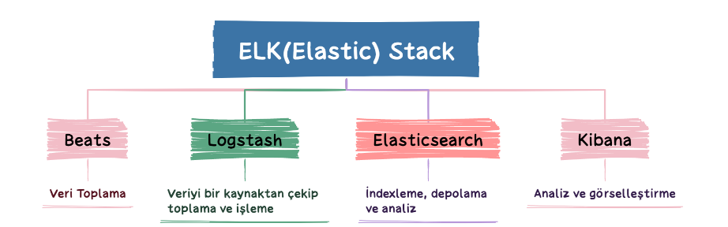
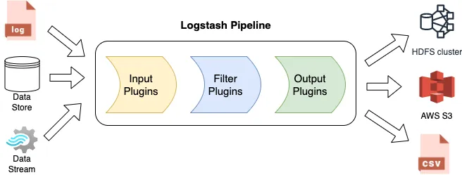

                        Filebeat nedir?
Elasticsearch tarafından geliştirilmiştir, log shipper - log göndericidir. Filebeat genellikle sunuculardaki log dosyalarını okuyarak bu logları Elasticsearch'e ya da Logstash'e gönderir.
* Sistemdeki log dosyalarını takip eder(örneğin /var/log/syslog gibi)
* Yeni log satırlarını takip eder ve bunları Elastic Stack'e aktarır.
* Kaldığı yeri unutmadan devam edebilir, Filebeat her log dosyasında en son nereye kadar veri gönderdiğini registry(kayıt) dosyasına yazar.
   Ağ kesintisi, sistem kapanması, Elasticsearch erişilemezliği gibi durumlarda, filebeat yeniden başladığında kaldığı yerden devam eder, veri kaybı olmaz.
* Harvester mantığı: --> Her log dosyası için bir harvester çalıştırır. Harvester, log dosyasını okuyup gönderen bileşendir.
* diğer beats türleri vardır: 1- Winlogbeat; Windows işletim sisteminin event loglarını toplar.
                                2- Metricbeats; Sistem kaynakları(CPU, bellek, disk, ağ vs.) gibi host metrikleri toplar.
                                3- Packetbeat; Ağ trafiğini analiz eder, network verisini gönderir.
                                4- Auditbeat; Linux audit framework üzerinden güvenlik olaylarını toplar.
                                5- Heartbeat; Sistemlerin erişilebilirliğini(ping, http vs.) kontrol eder, uptime verisini gönderir.
* Back pressure: Eğer elasticsearch veya logstash yoğunluktan dolayı logları alamazsa: Filebeat kendini yavaşlatır, dosya okuma hızını düşürerek sistemi zorlamaz.
                        Filebeat Nasıl Çalışır?
* Filebeat yapılandırma dosyasında(filebeat.yml) tanımladığın dizin veya dosyalar için input başlatılır. Bu inputlar, belirttiğin log dosyalarını izlemeye başlar.
* Filebeat, izlenen konumda bir log dosyası bulursa: O dosya için ayrı bir harvester(toplayıcı) başlatır. Her harvester, sadece bir log dosyasını izler, o dosyadaki yeni eklenen satırları sürekli kontrol eder.
  * Harvester, okuduğu yeni log satırlarını libbeat adlı ara katmana gönderir. libbeat, tüm Beats araçlarında ortak olan, veri toplama ve gönderme altyapısıdır.
          harvester çalıştığı sürece, okuduğu dosya açık kalır. Bu işletim sisteminde o dosyaya ait file descriptor sürekli aktiftir demektir.
          dosya silinmiş ya da taşınmış gibi görünse bile, harvester bu dosyaya erişmeye devam eder. Çünkü işletim sistemi, dosya descriptoru açık olduğu sürece o dosyaya fiziksel olarak erişilebilir.
            Silinen bir dosya, harvester tarafından hâlâ okunuyorsa: Disk üzerinde kapladığı alan hemen boşalmaz. Çünkü sistem dosyanın fiziksel içeriğini hâlâ saklar. Filebeat’in yapılandırma dosyasında bu davranış kontrol edilebilir.
    close.on_state_change.inactive: Dosyada belirli bir süre yeni veri gelmemişse, harvester kapanır ve dosya kapatılır.
    Harvester kapatıldığında ne olur?  Harvester kapanınca:Dosyaya erişim sağlayan file handler (dosya tanıtıcısı) da kapatılır. Eğer dosya daha önce silinmiş ama harvester açık olduğu için hâlâ sistemde tutuluyorsa: Bu alan serbest bırakılır, disk alanı boşalır.
  
* libbeat, gelen log kayıtlarını Toplar, işler ve yapılandırmada belirtilen çıktıya gönderir. Elasticsearch, Logstash, kafka vs.
*   yml dosyasında olan ayarlara dair notlar:
    1- clean_inactive: 3h # 3 saattir değişmemiş (inaktif) log dosyalarını “tamamen unutsun.”
    Ne demek "unutmak"? ilebeat normalde okuduğu her log dosyasının nerede kaldığını (offset) ve diğer bilgileri .filebeat registry dosyasında saklar.
    Ama clean_inactive: 3h dersen: Bir log dosyası 3 saat boyunca hiç yazılmamışsa, filebeat hem onu okumayı bırakır hem de registry den siler. Eğer o dosyaya sonra yeniden yazılırsa, baştan okur, kaldığır yerden değil.
    Bu özellik ne zaman kullanılır?  --> Çok fazla kısa ömürlü log dosyası varsa(örn: günlük oluşa loglar) --> kaynak tüketimini azaltmak istiyorsan(registry büyümesin diye)
    

    2- setup.ilm.enabled: false ve setup.template.enabled: false ne işe yarar?
       setup.template.enabled: false:  --> filebeat, elasticsearche otomatik template göndermesin demek. Yani log formatını sen elle tanımlayacaksın.
       setup.ilm.enabled: false: --> index lifecycle management(ilm) kapalı. Yani, log verilerinini ne zaman silineceği veya taşınacağı gibi işlemleri sen manuel yöneteceksin.
      Bu özellikleri ne zaman kullanmalısın? --> Daha kontrollü, özelleştirilmiş bir yapı istiyorsan. --> Kurumsal ortamda genelde Devops veya Elasticsearch adminleri, bu ayarları elle yapar.

---- docker compose yml dosyasını kurduktan sonra, her şeyin yolunda olduğunu anlamak için şu kontrolleri yapmalısın:
1) Filebeat Logstash’e bağlandı mı?
   docker compose logs --tail=120 filebeat

2) Logstash pipeline 5044’ü dinliyor mu?
   docker compose logs --tail=200 logstash

3) Elasticsearch’te index oluştu mu?

komutumuz şu:

curl -k -u "elastic:${ELASTIC_PASSWORD}" 'https://localhost:9200/_cat/indices?v'

şifreli hali ise şu şekilde olacak: ben deneme amaçlı bir şifre vereyim buraya:

curl -k -u "elastic:elastic123" 'https://localhost:9200/_cat/indices?v'

4) Kibana’da görselleştirme

Kibana → http://localhost:5601

------- proje kapsamı --> güncel elastic search sürümünü yükleyeceğim
1- elastic search için bir node yapacağım replicalara girmeyeceğim shardlara girmeyeceğim.
    logları günlük tutacağım, 7 günden sonraki logları otomatik sildireceğim
    tek node elastic kuracağım, filebeay ve logstah ayakta iken elastic in çökmesi ve yeniden ayağa kalkana kdardki logları kaybetmemsi üzerine kurgu
2- güvenlik katmanı ekleyeceğim

3- APM nedir? kibana veya elastic üzerinden bunu nasıl entegre edebilirim. SErvice Map yaopısını nasıl bulabilirim, bütün servislerin birbirini hangi sırada çağırdığın bilgisini görebiliyorum

front end veya backend agentlar vasıtası ile Elastic APM servera veri gönderir --> elastic search -> kibana

 --> cursore kod yazdırırken isteyeceklerim:
 1- filebeat için prod ortama uyumlu olması adına chatgpt şunları önerdi:
   * TLS / Authentication (Güvenlik)
     output.logstash:
     ssl.enabled: true
     ssl.certificate_authorities: ["/etc/filebeat/certs/ca.crt"]
     ssl.certificate: "/etc/filebeat/certs/filebeat.crt"
     ssl.key: "/etc/filebeat/certs/filebeat.key"

        Neden önemli? prod ortamda logların logstashe şifrelenmiş ve kimlik doğrulamalı gitmesi gerekir. Aksi takdirde loglar  açık ağda düz metin gidebilir.

    * 📛 Log Kaynağı Etiketleme (fields)
           fields:
                env: production
                service: spring-boot-app
                fields_under_root: true 

        Neden önemli? Kibana'da filtreleme, dashboard ve alarm kurmak için çok kullanışlı olur.

     * 📊 Monitoring / Metric Output (isteğe bağlı)   --> bu madddeyi çok anlamadım?
      Prod’da merkezi log yönetimi yanında Filebeat’in kendisini izlemek de önemlidir.
        monitoring:
            enabled: true
            elasticsearch:
            hosts: ["https://elasticsearch:9200"]
            username: "beats_system"
            password: "your-password"

        * 4. 📁 Volume ve Path Uyum Kontrolü  --> bunun da çok anlamadım
                Eğer Filebeat bir container içinde çalışıyorsa, paths: /logs/spring-boot-app*.log kısmında:
                Host veya container içinde doğru volume mount yapılmalı.
                
                Örn:
                
                bash
                Copy
                Edit
                docker run -v /var/logs:/logs ...

                        Logstash

* logstash, log dosyalarına ek olarak xml, html ve csv gibi dosyaları gerçek zamanlı olarak işleyebilir. Aynı zamanda veri manipülasyonu yapılarak yalnızca gerekli veriler ile çalışılabilir. 
* log stahsda filteleme yapılır, bu aşamada veri manipülasyonu yapılır. İstenmeyen bazı parametrelerin silinmesi, filtreleme, bazı değerlerin veya formatın değiştirilmesi gibi işlemler uygulanabilir.
* logstash kullanarak beats, rabbitmp ve hatta twitter gibi birçok farklı konumdan logları toplayabilir, filter plug-in ve regexler kullanarak logları parse layabilir. 
   Örneğin, geoip filter plug-in kullanarak ERROR loglarının harita üzerinde en çok nerelerden geldiğini görebilirsiniz ve sonrasında bu logları Elasticsearch, sentry gibi log aggregatorlara
    gönderebilir ya da herhangi bir dosyaya yazabilirsiniz.
* ücretsiz ve açık kaynaklıdır. Gerçek zamanlı olarak işler.
* Logstash, farklı(uyumsuz) kaynaklardan gelen verileri dinmaik şekilde birleştirebilir ve bunları seçtiğiniz hedef sistemlere normalize ederek aktarabilir.
   yani; JSON, syslog, CSV,Apache logları gibi farklı formatlardaki verileri alabilir. Tüm bu farklı verileri ortak bir yapıya(örneğin Elasticsearche uygun hale) getirir.
         Ardından bu verileri Elasticsearch, dosya, Kafka gibi sistemlere gönderir.
* Verilerdeki gereksiz alanlar silinebilir, eksik bilgiler tamamlanabilir. Böylece temiz ve anlamlı veri, Kibana gibi araçlara kolayca analiz edilir hale gelir.
* Logstash veri işleme hattı üç bölümden oluşur: Giriş (Input), Filtre (Filter) ve Çıkış (Output).
   
    * Input Stage: logstash, her türden ve kaynaktan veri almak için farklı giriş eklentileri kullanır. Bu eklentiler sayesinde veriler çeşitli sistemlerden çekilebilir.
    * Filter Stage: logstash, filtre eklentilerini kullanarak gelen veriden gerekli bilgileri çıkarır ve bunları daha anlamlı ve standart bir formata dönüştürür.
            farklı işleme ihtiyaçları için farklı filtre eklentileri vardır.-> JSON: json verileri ayrıştırır. --> xml: xml formatındaki verileri işler. ...GeoIp: ip adresinden ülke, şehir, konum gibi bilgiler çıkarır.
    * Output stage: Giriş aşamasında veri nasıl alınıyorsa, çıkış aşamasında da logstash, toplanmış ve temizlenmiş veriyi belirli hedeflere gönderir. örnek Elasticsearch, AWS s3, 
                    Logstash sadece tek bir yere değil, Birden fazla hedefe veri göndermeni sağlar. Ayrıca kendi yönlendirme kurallarını yazabilirsin. Örnek: Hatalı loglar (level: error) --> bir Elasticsearch indexine, normal loglar(level info) başka bir indexe veya s3 e

   * Logstash'in 200 den fazla eklenti içeren yapısı sayesinde, veri alma, işleme ve gönderme aşamalarını kendi ihtiyaçlarına göre özgürce tasarlayabilirsin. Bu da logstashi modüler bir yapı olduğunu gösteriyor.
        Input, Filter ve output gibi her bölümde farklı eklentiler kullanılabilir. Bu parçaları istediğin gibi birleştirip veri işleme sürecini özelleştirebilirsin.
        Örnek: input: Filebeat --> TCP --> Kafka
               filter: JSON --> mutate  --> geoip
               output : Elasticsearch + S3(aynı anda iki yere)

    * Veriler farklı şekillerde geldiğinde, analiz edilebilir hale getirmek çok zordur. Eğer veriler aynı yapıda değilse, onları karşılaştırmak, anlamlı sonuçlar çıkarmak ve etkileşimleri görmek
        oldukça güçtür.İşte bu yüzden logstash gibi araçlar, verileri tek tip ve analiz edilebilir bir yapıya dönüştürmede kritik bir rol oynar. Günümüzde veriler çok farklı kaynaklardan ve farklı formatalarda geliyor.
            Bu durum veriyi etkili bir şekilde kullanmayı zorlaştırıyor. Gelebilecek farklı formatlardaki verilere örnek verelim. Yapılandırılmış veriler(Tablo gibi düzenli, örneğin veritabanı kayıtlar)
            Yar yapılandırılmış(json,xml gibi belli bir düzen var ama sabit değil). Yapısız(serbest metin - e-postalar, PDF, loglar)
                Neden sorun oluyor, --> Analiz motorları örneğin elasticsearch, spark bu verileri doğrudan işleyemez çünkü formatlar tutarsız olabilir. Farklı formatlara sahip veri kümelerini: * karşılaştırmak, * birleştirmek, * Analiz etmek çok zordur.
  * Filtreleme, logstashin harika özelliklerinden biridir. Çeşitli filtre seçeneklerini kullanarak, loglardan veri almak için ince ayarlar yapabilirsiniz.
          Filtreleme için bir kaç yok var:
    1- grok; 2- date; 3- key=value;  4- multiline;  5-mutate.
                 1- Grok Filter
         --> Grok filtresi, metinleri ön tanımlı desenlerle eşleştirerek veri alanlarına ayırmanı sağlar. Özellikle log dosyalarının parçalanıp anlamlı parçalara ayrılması için
             kullanılır.
          💡 Temel Kullanımı
                 filter {
                 grok {
                 match => { "message" => "%{COMMONAPACHELOG}" }
                 }
                 }
            
      Bu örnekte: message: Girdi log satırı. %{COMMONAPACHELOG}: Grok tarafından sağlanan hazır bir desen (Apache log formatı)
        
            2- Date Filter
         --> Logstash, her aldığı olaya otomatik olarak bir @timestamp (olayın işlendiği zaman) değeri atar. Ama bu, logun gerçek oluştuğu zamanı değil,
            sadece Logstash in  olayı aldığı zamanı gösterir. Eğer logun içinde gerçek zaman bilgisi varsa, bunu yakalayarak gerçek olay zamanını @timestamp
           alanına yazmak içn date filtresi kullanılır.
          
            Temel kullanımı

                  filter {
                  date {
                  match => ["timestamp", "dd/MMM/yyyy:HH:mm:ss Z"]
                  target => "@timestamp"
                  }
                  }
              yukarıdaki örnekte; "timestamp": Daha önce grok filtresi ile ayrıştırılmış zaman alanı.  / "dd/MMM/yyyy:HH:mm:ss Z": Log’un içindeki zamanın biçimi (örneğin 06/Aug/2025:10:00:00 +0000)
                  / @timestamp: Logstash’in zaman alanı; buraya yazılır.
         
            
               Örnek Akış
          log
          message: 127.0.0.1 - - [06/Aug/2025:10:00:00 +0000] "GET /index.html HTTP/1.1" 200 2326

         logstash

             filter {
             grok {
             match => { "message" => "%{IP} - - \[%{HTTPDATE:timestamp}\] ..." }
             }
             
             date {
             match => ["timestamp", "dd/MMM/yyyy:HH:mm:ss Z"]
             target => "@timestamp"
             }
             }
         
         -> grok filtresi ile logtaki tarih timestamp alanına çıkarılır. --> date filtresi bu timestamp alanını alır ve @timestamp olarak atar.

        diğer filtreleme için araştracağım sonrasında
  
